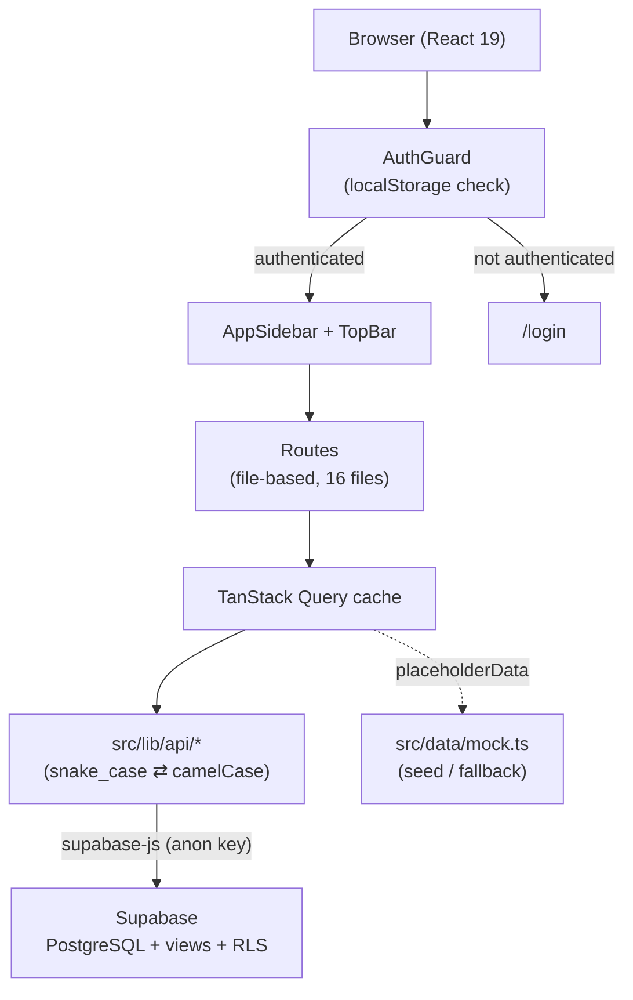

# ปุ๋ยไทย CRM — Agricultural Store ERP

ระบบ ERP/CRM สำหรับร้านค้าเกษตร (ปุ๋ย ยา เมล็ดพันธุ์ อุปกรณ์การเกษตร) สร้างด้วย TanStack Start + React 19 + Supabase

UI เป็นภาษาไทยทั้งหมด ออกแบบสำหรับร้านสาขาเดียวที่ดูแลระบบโดยผู้ใช้ `admin` คนเดียว

## Overview

โปรเจกต์นี้รวมงานหลังร้านของร้านค้าเกษตรไว้ในแอปเดียว:

- **ขายหน้าร้าน (POS)** — เลือกสินค้า สแกนบาร์โค้ด รับชำระเงิน พิมพ์ใบเสร็จ พร้อมตัดสต็อกและบันทึกออเดอร์ลงฐานข้อมูลจริง
- **CRM + ข้อมูลการเพาะปลูก** — เก็บข้อมูลแปลงปลูกของลูกค้า (พืช/ช่วงการปลูก/พื้นที่/วันปลูก) แล้วใช้คำนวณสินค้าที่ควรเสนอในแต่ละช่วง
- **บริหารสินค้าและสต็อก** — แคตตาล็อกสินค้า ต้นทุน/กำไรขั้นต้น บันทึกรับเข้า–จ่ายออก–ปรับปรุง ตรวจนับสต็อก
- **รายงาน** — ยอดขาย กำไร (คำนวณจาก `price - cost` ของแต่ละรายการ) สินค้าขายดี ลูกค้าที่ควรติดต่อ พยากรณ์ความต้องการสินค้า

จุดเด่นคือการเชื่อมข้อมูลการเพาะปลูกเข้ากับการขาย — ระบบดูจากวันปลูกและรอบของพืชแต่ละชนิดว่าลูกค้าควรอยู่ช่วงไหน แล้วแนะนำสินค้า + คำนวณปริมาณตามพื้นที่จริง (ไร่)

## Features

### ที่เชื่อมกับ Supabase แล้ว (บันทึกข้อมูลจริง)

| ฟีเจอร์ | รายละเอียด |
| --- | --- |
| แดชบอร์ด | สถิติวันนี้/เดือนนี้ กำไรรายวัน–รายเดือน กราฟยอดขาย สินค้าขายดี ลูกค้าดีที่สุด สินค้าใกล้หมด กิจกรรม การแจ้งเตือน |
| POS checkout | สร้าง `orders` + `order_items` (เก็บ cost ต่อบรรทัด) → ลดสต็อก → บันทึก `stock_movements` → อัปเดตยอดสะสมลูกค้า → log activity |
| แคตตาล็อกสินค้า | list / create / update / delete จาก Supabase, กรองตามหมวด/สถานะ, สลับมุมมอง grid–table |
| รายละเอียดสินค้า | ดึงข้อมูลสดจาก Supabase, แก้ไขผ่าน Sheet, ลบสินค้า |
| คลังสินค้า | บันทึกการเคลื่อนไหวสต็อก (รับเข้า / จ่ายออก / ปรับปรุง) ลง `stock_movements` |
| การแจ้งเตือน | อ่านจาก `notifications`, mark read / mark all read, กดแล้วลิงก์ไปหน้าที่กรองไว้ |

### ที่ยังใช้ข้อมูล mock (UI ครบ แต่ยังไม่เชื่อม Supabase)

- หน้าลูกค้า `/customers` — รวมถึงข้อมูลการเพาะปลูก, สินค้าแนะนำ, พิมพ์ใบเสนอราคา
- หน้าการขาย `/sales` และรายละเอียดคำสั่งขาย `/sales/$orderId`
- หน้าโปรโมชัน `/promotions`

รายละเอียดใน [Known Limitations](#known-limitations)

### ฟีเจอร์ทั่วแอป

- **Agronomy engine** (`src/lib/agronomy.ts`) — รอบการปลูกของ 10 พืช, คู่มือสินค้าตามช่วง + อัตราการใช้ต่อไร่, คำนวณ % ความคืบหน้า, ตรวจแปลงที่ข้อมูลไม่อัปเดต, พยากรณ์ความต้องการสินค้า 30 วัน
- **พิมพ์เอกสาร** (`src/lib/print.ts`) — ใบเสร็จ POS, ใบเสร็จคำสั่งขาย, ใบเสนอราคา ผ่าน `window.print()`
- **ส่งออก CSV** (`src/lib/export.ts`) — ส่งออกเฉพาะข้อมูลที่กรองไว้ ใช้ในหน้าสินค้า/ขาย/ลูกค้า/โปรโมชัน/แดชบอร์ด
- **Command palette** — `Cmd/Ctrl+K` ค้นหา + keyboard shortcut แบบ Linear (`g` + key เพื่อสลับหน้า)
- **Responsive** — sidebar ยุบได้, POS มีตะกร้าแบบ bottom sheet บนมือถือ

## Tech Stack

| ชั้น | เทคโนโลยี |
| --- | --- |
| Framework | TanStack Start `^1.168.32` (SSR + file-based routing) |
| Router | TanStack Router `^1.170.18` |
| UI Library | React `^19.2.0` |
| Data fetching | TanStack Query `^5.101.1` |
| Styling | Tailwind CSS `^4.2.1` (ผ่าน `@tailwindcss/vite`) |
| Components | shadcn/ui (Radix UI primitives) — 46 component ใน `src/components/ui/` |
| Icons | lucide-react `^0.575.0` |
| Charts | Recharts `^3.10.1` |
| Toast | sonner `^2.0.7` |
| Database | Supabase (PostgreSQL) ผ่าน `@supabase/supabase-js` `^2.112.2` |
| Forms | react-hook-form `^7.71.2` + zod `^3.24.2` + `@hookform/resolvers` |
| Build | Vite `^8.2.0` |
| Server runtime | Nitro `3.0.260603-beta` |
| Language | TypeScript `^5.8.3` (strict + `exactOptionalPropertyTypes`) |
| Lint / Format | ESLint `^9.32.0` + Prettier `^3.7.3` (prettier บังคับผ่าน eslint) |
| Vite config preset | `@lovable.dev/vite-tanstack-config` `2.9.1` |

Vite config ใช้ preset จาก Lovable ที่รวม plugin ไว้แล้ว (tanstackStart, viteReact, tailwindcss, tsConfigPaths, nitro, path alias `@`) — ห้ามเพิ่ม plugin เหล่านี้ซ้ำ

## Architecture



**หมายเหตุสำคัญ:** ไม่มี backend API layer ของตัวเอง — client เรียก Supabase ตรงด้วย anon key ทุก query ผ่าน `useQuery` มี `placeholderData` เป็น mock data เพื่อ fallback เมื่อ Supabase ยังไม่ได้ตั้งค่าหรือล่ม

SSR: `src/server.ts` เป็น entry ที่ห่อ error handler, `src/start.ts` เป็น start config, `src/routes/__root.tsx` เป็น app shell

## Project Structure

```text
fieldstone-erp/
├── src/
│   ├── routes/                      # file-based routing (TanStack Router)
│   │   ├── __root.tsx               # app shell + AuthProvider + AuthGuard + layout
│   │   ├── index.tsx                # / แดชบอร์ด
│   │   ├── login.tsx                # /login
│   │   ├── customers.tsx            # /customers CRM + การเพาะปลูก
│   │   ├── pos.tsx                  # /pos ขายหน้าร้าน
│   │   ├── products.index.tsx       # /products
│   │   ├── products.$productId.tsx  # /products/:id
│   │   ├── inventory.index.tsx      # /inventory
│   │   ├── inventory.stock-in.tsx   # /inventory/stock-in
│   │   ├── inventory.stock-out.tsx  # /inventory/stock-out
│   │   ├── inventory.adjustment.tsx # /inventory/adjustment
│   │   ├── inventory.movements.tsx  # /inventory/movements
│   │   ├── inventory.count.tsx      # /inventory/count
│   │   ├── sales.index.tsx          # /sales
│   │   ├── sales.$orderId.tsx       # /sales/:id
│   │   └── promotions.index.tsx     # /promotions
│   │
│   ├── components/
│   │   ├── ui/                      # shadcn/ui primitives (46 files)
│   │   ├── common/                  # StatCard, StatusBadge, DataToolbar, EmptyState
│   │   ├── layout/                  # AppSidebar, TopBar, PageHeader
│   │   └── inventory/               # InventoryOpsPage (ใช้ร่วม 5 หน้าคลัง)
│   │
│   ├── lib/
│   │   ├── api/                     # Supabase data layer แยกตาม domain
│   │   │   ├── index.ts             # barrel export
│   │   │   ├── products.ts          # list/get/create/update/remove/adjustStock
│   │   │   ├── customers.ts         # customersApi + cultivationsApi
│   │   │   ├── orders.ts            # list/create/createWithItems/updateStatus
│   │   │   ├── movements.ts         # list/create
│   │   │   ├── warehouses.ts        # list
│   │   │   ├── activities.ts        # list/create
│   │   │   ├── notifications.ts     # list/markRead/markAllRead
│   │   │   └── dashboard.ts         # stats + charts + profit + top products
│   │   ├── supabase.ts              # Supabase client + supabaseReady flag
│   │   ├── auth.tsx                 # auth context (localStorage)
│   │   ├── agronomy.ts              # engine คำนวณช่วงปลูก → สินค้าแนะนำ
│   │   ├── print.ts                 # พิมพ์ใบเสร็จ / ใบเสนอราคา
│   │   ├── export.ts                # toCSV / downloadCSV / exportToCSV
│   │   ├── format.ts                # currency / compactCurrency / numberFmt
│   │   └── utils.ts                 # cn()
│   │
│   ├── types/index.ts               # domain types ทั้งหมด
│   ├── data/mock.ts                 # mock data (seed / query fallback)
│   ├── hooks/use-mobile.tsx
│   ├── router.tsx                   # router + QueryClient
│   ├── server.ts                    # SSR entry (error wrapper)
│   ├── start.ts                     # TanStack Start config
│   └── routeTree.gen.ts             # auto-generated — ห้ามแก้มือ
│
├── supabase/schema.sql              # schema ทั้งหมด: tables + views + RLS + seed
├── public/                          # favicon.ico, robots.txt
├── AGENTS.md                        # coding conventions ของโปรเจกต์
├── vite.config.ts
├── tsconfig.json
├── eslint.config.js
└── package.json
```

## Requirements

- **Node.js** — ไม่มี `engines` field กำหนดไว้ใน `package.json` แต่ Vite 8 ต้องการ Node 20.19+ / 22.12+ ขึ้นไป (พัฒนาบน Node 24)
- **Package manager** — npm (โปรเจกต์ใช้ `package-lock.json`)
- **Supabase project** — สำหรับฟีเจอร์ที่เชื่อมฐานข้อมูล (แอปรันได้โดยไม่มี Supabase แต่จะแสดงเฉพาะ mock data)

## Installation

```bash
git clone https://github.com/Jestx170/puy.git
cd puy
npm install
```

ตั้งค่า environment variables:

```bash
cp .env.example .env
# แก้ .env ใส่ค่าจาก Supabase project ของคุณ
```

ตั้งค่าฐานข้อมูล — เปิด Supabase Dashboard → SQL Editor → รัน `supabase/schema.sql` (รันซ้ำได้ ใช้ `if not exists` และ `where not exists` กันข้อมูลซ้ำ)

## Environment Variables

Source of truth: `.env.example` และ `src/lib/supabase.ts`

| Variable | Required | Description |
| --- | --- | --- |
| `VITE_SUPABASE_URL` | ไม่บังคับ | URL ของ Supabase project เช่น `https://xxx.supabase.co` |
| `VITE_SUPABASE_ANON_KEY` | ไม่บังคับ | Supabase anon (public) key |

ทั้งสองตัวไม่ throw error ถ้าไม่ได้ตั้ง — `src/lib/supabase.ts` จะ `console.warn` แล้วใช้ค่า placeholder ทำให้แอปยังรันได้ด้วย mock data ตัวแปร `supabaseReady` บอกสถานะว่าตั้งค่าครบหรือยัง

> ⚠️ ตัวแปรที่ prefix `VITE_` จะถูกฝังลงใน client bundle ทั้งหมด ห้ามใส่ service role key หรือ secret ใด ๆ

## Development

```bash
npm run dev
```

รันที่ `http://localhost:8080` (port ตั้งใน Lovable preset — ถ้าถูกใช้แล้วจะเลื่อนเป็น 8081)

เข้าสู่ระบบด้วย `admin` / `admin123` (ดู [Security](#security) — credential เป็น hardcode)

Warning `vite-tsconfig-paths` ที่ขึ้นตอน dev มาจาก `@lovable.dev/vite-tanstack-config` ไม่กระทบการทำงานและปิดจาก user config ไม่ได้

## Build

```bash
npm run build          # production build (Nitro → Cloudflare preset)
npm run build:dev      # build โหมด development
npm run preview        # preview build ที่ได้
```

### ตรวจสอบคุณภาพ

```bash
npx tsc --noEmit       # typecheck (ไม่มี npm script — เรียกตรง)
npm run lint           # ESLint + Prettier (prettier บังคับเป็น error)
npx eslint . --fix     # จัด format อัตโนมัติ
npm run format         # prettier --write .
```

สถานะปัจจุบัน: typecheck ผ่าน 0 error, lint ผ่าน 0 error (มี 8 warning จาก `react-refresh/only-export-components` ในไฟล์ shadcn/ui และ `auth.tsx`)

## Testing

ไม่มี test — โปรเจกต์ไม่มี test framework, test file, หรือ test script ใด ๆ

## Deployment

Build output ใช้ Nitro preset **`cloudflare-module`** (ตรวจจาก `.output/nitro.json`) และ generate `wrangler.json` ให้อัตโนมัติ

```bash
npm run build
npx wrangler deploy           # deploy ไป Cloudflare Workers
npx wrangler dev              # preview แบบ Cloudflare runtime
```

ไม่มี Dockerfile, ไม่มี CI/CD pipeline (`.github/` ไม่มีอยู่), ไม่มี config สำหรับ platform อื่น

โปรเจกต์เชื่อมกับ [Lovable](https://lovable.dev) — commit ที่ push ไป branch ที่เชื่อมไว้จะ sync กลับเข้า Lovable editor ห้าม force push หรือ rewrite history ที่ push ไปแล้ว

## Security

### สถานะปัจจุบัน

| ด้าน | Implementation |
| --- | --- |
| Authentication | Hardcoded credential ใน `src/lib/auth.tsx` + localStorage (`puithai_auth`) |
| Authorization | ไม่มี — ผู้ใช้ที่ login แล้วเข้าถึงได้ทุกหน้า |
| RLS | เปิดครบทุกตาราง แต่ policy อนุญาต anon ทำได้ทุกอย่าง (`for all using (true) with check (true)`) |
| Input validation | `zod` + `react-hook-form` ติดตั้งแล้ว, validation ระดับ DB ใช้ `check` constraint |
| Secrets | `.env` อยู่ใน `.gitignore` แล้ว |
| Supply chain | `bunfig.toml` ตั้ง `minimumReleaseAge = 86400` (24 ชม.) |

### ข้อจำกัดด้านความปลอดภัยที่ต้องรู้

โปรเจกต์นี้ **ไม่เหมาะกับการ deploy สู่อินเทอร์เน็ตสาธารณะในสถานะปัจจุบัน**:

1. **Credential เป็น hardcode ใน client bundle** — `admin` / `admin123` อยู่ใน `src/lib/auth.tsx` ซึ่งถูก bundle ไปฝั่ง client ใครก็อ่านได้จาก source ที่ browser โหลด
2. **Auth เป็นแค่ UI gate** — ตรวจ localStorage ฝั่ง client เท่านั้น ไม่มี session token ไม่มีการตรวจฝั่ง server แก้ localStorage เองก็ผ่านได้
3. **RLS อนุญาต anon ทุกอย่าง** — ใครมี anon key (ซึ่งอยู่ใน client bundle) อ่าน/เขียน/ลบข้อมูลทุกตารางได้โดยไม่ต้อง login
4. **ไม่มีระบบสิทธิ์** — ระบบออกแบบสำหรับ admin คนเดียว ไม่มี role-based access control

ถ้าจะใช้งานจริงแบบเปิดสาธารณะ ต้องเปลี่ยนไปใช้ Supabase Auth และเขียน RLS policy ที่ผูกกับ `auth.uid()` ก่อน

`bunfig.toml` มี supply-chain guard แต่ **npm ไม่รองรับ `minimumReleaseAge`** — เมื่อเพิ่ม dependency ด้วย npm ต้องเช็ควันเผยแพร่เองด้วย `npm view <package> time.<version>` (ควรเผยแพร่มาแล้วอย่างน้อย 7 วัน)

## Database

PostgreSQL บน Supabase — schema ทั้งหมดอยู่ใน `supabase/schema.sql`

### Tables

| Table | PK | คำอธิบาย |
| --- | --- | --- |
| `products` | `text` | สินค้า: ราคา, ต้นทุน, สต็อก, ขั้นต่ำ, หน่วย, สถานะ, emoji |
| `warehouses` | `text` | คลังสินค้า (seed 1 คลัง: คลังหลัก) |
| `stock_movements` | `uuid` | การเคลื่อนไหวสต็อก — `qty` บวก = รับเข้า, ลบ = จ่ายออก |
| `customers` | `text` | ลูกค้า: ประเภท, tier, ยอดสะสม, จำนวนออเดอร์, tags |
| `cultivations` | `text` | แปลงเพาะปลูกของลูกค้า: พืช, ช่วง, พื้นที่ (ไร่), วันปลูก, วันเก็บเกี่ยว |
| `orders` | `text` | คำสั่งขาย: ยอดรวม, สถานะ, ช่องทาง, วิธีชำระ |
| `order_items` | `uuid` | รายการในออเดอร์ — เก็บทั้ง `price` และ `cost` เพื่อคำนวณกำไร |
| `activities` | `uuid` | ไทม์ไลน์กิจกรรม |
| `notifications` | `uuid` | การแจ้งเตือน + `link` ปลายทาง |

### Relationships

```text
customers 1─┬─N cultivations   (on delete cascade)
            └─N orders          (on delete set null)
orders    1───N order_items     (on delete cascade)
products  1─┬─N order_items     (on delete set null)
            └─N stock_movements (on delete set null)
```

### Views (สำหรับรายงาน)

| View | ใช้ที่ |
| --- | --- |
| `v_dashboard_stats` | สถิติวันนี้/เดือนนี้ + กำไร + ออเดอร์รออนุมัติ |
| `v_sales_by_day` | กราฟยอดขาย 7 วัน |
| `v_revenue_trend` | เทรนด์รายได้รายเดือน + เป้า |
| `v_profit_by_day` / `v_profit_by_month` | กราฟกำไร (revenue − cogs) |
| `v_top_products` | สินค้าขายดี |
| `v_best_customers` | ลูกค้ายอดสูงสุด |
| `v_warehouse_summary` | สรุปคลัง |

### Triggers

- `trg_products_updated` / `trg_customers_updated` — อัปเดต `updated_at` อัตโนมัติ
- `trg_products_status` — คำนวณ `products.status` (`active` / `low` / `out`) จาก `stock` เทียบ `min_stock`

### Access control

RLS เปิดครบทุกตาราง แต่ policy ทั้งหมดเป็น `for all using (true) with check (true)` สำหรับ anon — ดู [Security](#security)

## API / Server Functions

ไม่มี REST API หรือ server function — client เรียก Supabase ตรงผ่าน `supabase-js` โดยมี data layer ใน `src/lib/api/` เป็นตัวกลางแปลง snake_case (DB) ⇄ camelCase (TypeScript)

| Module | Functions |
| --- | --- |
| `productsApi` | `list()`, `get(id)`, `create(p)`, `update(id, patch)`, `remove(id)`, `adjustStock(id, delta)` |
| `customersApi` | `list()`, `get(id)`, `create(c)`, `update(id, patch)`, `remove(id)` |
| `cultivationsApi` | `listByCustomer(customerId)`, `create(c)`, `remove(id)` |
| `ordersApi` | `list(filter?)`, `create(o)`, `createWithItems(o, lines)`, `updateStatus(id, status)` |
| `movementsApi` | `list(filter?)`, `create(m)` |
| `warehousesApi` | `list()` |
| `activitiesApi` | `list(limit?)`, `create(a)` |
| `notificationsApi` | `list(limit?)`, `markRead(id)`, `markAllRead()` |
| `dashboardApi` | `stats()`, `salesByDay()`, `revenueTrend()`, `profitByDay()`, `profitByMonth()`, `topProducts()`, `bestCustomers()`, `lowStockProducts()` |

Import ผ่าน barrel: `import { productsApi, ordersApi } from "@/lib/api"`

## Internationalization

ไม่มีระบบ i18n — UI เป็นภาษาไทย hardcode ทั้งหมด `<html lang="th">` ตั้งไว้ใน `__root.tsx` ฟอนต์โหลด Plus Jakarta Sans + Noto Sans Thai จาก Google Fonts

## Project Status

**Development**

เหตุผล: ไม่มี test, ไม่มี CI/CD, auth ยังเป็น hardcoded credential, RLS ยังเปิดกว้าง, และหลายหน้ายังใช้ mock data (ดู Known Limitations)

## Known Limitations

### หน้าที่ยังไม่เชื่อม Supabase

หน้าเหล่านี้ UI ครบและใช้งานได้ แต่อ่าน/เขียนกับ `src/data/mock.ts` เท่านั้น — ข้อมูลไม่ persist และไม่ sync กับข้อมูลจริง:

| หน้า | ผลกระทบ |
| --- | --- |
| `/customers` | ข้อมูลลูกค้า, แปลงเพาะปลูก, สินค้าแนะนำ ทั้งหมดเป็น mock — เพิ่ม/แก้ลูกค้าไม่ถูกบันทึก |
| `/sales` | ตารางคำสั่งขายเป็น mock — ออเดอร์ที่สร้างจาก POS จะไม่ขึ้นที่นี่ (แต่ขึ้นในแดชบอร์ดเพราะดึงจาก view) |
| `/sales/$orderId` | รายละเอียดออเดอร์เป็น mock, รายการสินค้าในออเดอร์สร้างจาก `products.slice()` ไม่ใช่ `order_items` จริง |
| `/promotions` | โปรโมชันทั้งหมดเป็น mock — ไม่มีตาราง `promotions` ใน schema |

### ปัญหาอื่น

- **ไม่มี test เลย** — ไม่มี test framework ติดตั้ง
- **ไม่มี CI/CD** — ไม่มี `.github/workflows`
- **ไม่มี typecheck script** — ต้องเรียก `npx tsc --noEmit` เอง (ไม่อยู่ใน `package.json` scripts)
- **ไม่มี LICENSE file** — license ไม่ระบุ, `package.json` ตั้ง `"private": true`
- **ปุ่มบางปุ่มยังเป็น placeholder** — เช่น "พิมพ์ฉลาก" และ "สั่งซื้อ" ในหน้ารายละเอียดสินค้า, "ส่งออก" ในหน้าคลัง แสดงแค่ toast
- **ตัวเลขบางส่วนในหน้าคลังเป็นค่า hardcode** — StatCard "สต็อกคงเหลือรวม", "มูลค่าสต็อก", "เคลื่อนไหววันนี้" ใน `/inventory` ยังไม่คำนวณจากข้อมูลจริง
- **`package.json` ชื่อยังเป็น `tanstack_start_ts`** — ชื่อ template เริ่มต้น ไม่ตรงกับชื่อโปรเจกต์
- **ข้อมูล seed ใช้ปี 2026** — วันที่ใน mock/seed เป็นอนาคต อาจทำให้รายงานที่กรองตามวันดูแปลก
- **`MovementType` ยังมี `"โอนย้าย"`** — เก็บไว้ให้ตรงกับ DB check constraint แต่ UI ไม่ให้สร้างแล้ว (ระบบเป็นสาขาเดียว)

## Conventions

รายละเอียดเต็มอยู่ใน `AGENTS.md` สรุปที่สำคัญ:

- domain types อยู่ใน `@/types` เท่านั้น — ห้ามประกาศ interface ซ้ำในไฟล์อื่น
- ใช้ `useQuery` + `placeholderData` (mock) สำหรับ data fetching ทุกที่
- ใช้ `currency()` / `compactCurrency()` / `numberFmt()` จาก `@/lib/format` — ห้ามเขียน `Intl.NumberFormat` ตรงในหน้า
- `StatCard` tone รองรับแค่ `default` | `warning` | `info`
- ใช้ `AlertDialog` สำหรับ action ที่ทำลายข้อมูล ไม่ใช่แค่ toast
- ปุ่ม/การ์ดใช้ `rounded-xl`, การ์ดใช้ class `card-soft`
- `src/components/ui/` เป็น shadcn primitives — ไม่ควรแก้ตรง ๆ
- `src/routeTree.gen.ts` auto-generated — ห้ามแก้มือ

## License

ไม่ระบุ — ไม่มีไฟล์ `LICENSE` ในโปรเจกต์ และ `package.json` ตั้ง `"private": true` โดยไม่มี `license` field

## Author

Not documented — `package.json` ไม่มี `author` field

Repository: https://github.com/Jestx170/puy
