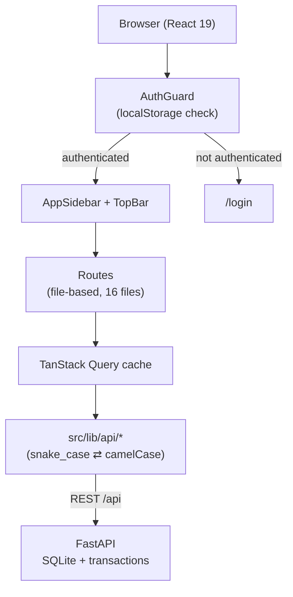

# ปุ๋ยไทย CRM — Agricultural Store ERP

ระบบ ERP/CRM สำหรับร้านค้าเกษตร (ปุ๋ย ยา เมล็ดพันธุ์ อุปกรณ์การเกษตร) สร้างด้วย React 19 + Vite SPA + FastAPI + SQLite และแพ็กเป็น Windows desktop app ด้วย PyInstaller

UI เป็นภาษาไทยทั้งหมด ออกแบบสำหรับร้านสาขาเดียวที่ดูแลระบบโดยผู้ใช้ `admin` คนเดียว

## Overview

โปรเจกต์นี้รวมงานหลังร้านของร้านค้าเกษตรไว้ในแอปเดียว:

- **ขายหน้าร้าน (POS)** — เลือกสินค้า สแกนบาร์โค้ด รับชำระเงิน พิมพ์ใบเสร็จ พร้อมตัดสต็อกและบันทึกออเดอร์ลงฐานข้อมูลจริง
- **CRM + ข้อมูลการเพาะปลูก** — เก็บข้อมูลแปลงปลูกของลูกค้า (พืช/ช่วงการปลูก/พื้นที่/วันปลูก) แล้วใช้คำนวณสินค้าที่ควรเสนอในแต่ละช่วง รองรับ **ลำไย** (18 ระยะ) และ **ทุเรียน** (21 ระยะ)
- **บริหารสินค้าและสต็อก** — แคตตาล็อกสินค้า ต้นทุนเฉลี่ยถ่วงน้ำหนัก (weighted average cost) วันหมดอายุต่อล็อต (FEFO) บันทึกรับเข้า–จ่ายออก–ปรับปรุง ตรวจนับสต็อก
- **รายงาน** — ยอดขาย กำไร (คำนวณจาก `price - cost` ของแต่ละรายการ) สินค้าขายดี ลูกค้าที่ควรติดต่อ พยากรณ์ความต้องการสินค้า
- **จัดการหมวดหมู่** — ผู้ใช้เพิ่ม/ลบหมวดหมู่สินค้าเองได้ผ่านหน้าตั้งค่าร้าน
- **โปรโมชัน** — ส่วนลด/คูปอง/แคมเปญ/ชุดสินค้า คำนวณส่วนลดอัตโนมัติใน POS

จุดเด่นคือการเชื่อมข้อมูลการเพาะปลูกเข้ากับการขาย — ระบบดูจากวันปลูกและรอบของพืชแต่ละชนิดว่าลูกค้าควรอยู่ช่วงไหน แล้วแนะนำสินค้า + คำนวณปริมาณตามพื้นที่จริง (ไร่)

## Features

ทุกหน้าเชื่อมต่อ FastAPI + SQLite แล้ว — ไม่มี mock data

| ฟีเจอร์ | รายละเอียด |
| --- | --- |
| แดชบอร์ด | สถิติวันนี้/เดือนนี้ กำไรรายวัน–รายเดือน กราฟยอดขาย สินค้าขายดี ลูกค้าดีที่สุด สินค้าใกล้หมด กิจกรรม การแจ้งเตือน |
| POS checkout | สร้าง `orders` + `order_items` → ลดสต็อก → บันทึก `stock_movements` → อัปเดตยอดสะสมลูกค้า → log activity (atomic RPC) |
| แคตตาล็อกสินค้า | list / create / update / delete จาก Supabase, กรองตามหมวด/สถานะ, สลับมุมมอง grid–table |
| รายละเอียดสินค้า | ดึงข้อมูลสดจาก Supabase, แก้ไขผ่าน Sheet, ลบสินค้า (soft delete), พิมพ์ฉลากบาร์โค้ด |
| คลังสินค้า | รับเข้า (พร้อมต้นทุนต่อล็อต + วันหมดอายุ) / จ่ายออก / ปรับปรุง / ประวัติเคลื่อนไหว / ตรวจนับสต็อก |
| ลูกค้า CRM | ข้อมูลลูกค้า + แปลงเพาะปลูก (ลำไย/ทุเรียน) + สินค้าแนะนำ + พิมพ์ใบเสนอราคา + บันทึกโน้ต |
| การขาย | ตารางคำสั่งขาย + รายละเอียด + พิมพ์ใบเสร็จ/ใบกำกับภาษี + ทำสำเนา + ยกเลิกคำสั่ง |
| โปรโมชัน | สร้าง/แก้/ลบ โปรโมชัน, คำนวณส่วนลดอัตโนมัติใน POS และใบเสนอราคา |
| หมวดหมู่สินค้า | เพิ่ม/ลบ หมวดหมู่ผ่านหน้าตั้งค่าร้าน (เก็บใน DB, มี fallback) |
| ตั้งค่าร้าน | ชื่อร้าน ที่อยู่ โทร Tax ID ข้อความใต้ใบเสร็จ — ใช้ในใบเสร็จ/ใบเสนอราคา |

### ฟีเจอร์ทั่วแอป

- **Agronomy engine** (`src/lib/agronomy.ts`) — รอบการปลูกของลำไย (332 วัน) และทุเรียน, คู่มือสินค้าตามช่วง, คำนวณ % ความคืบหน้า, พยากรณ์ความต้องการสินค้า 30 วัน
- **Weighted Average Cost** — รับเข้าสินค้าที่ต้นทุนต่างกันได้ ระบบคำนวณต้นทุนเฉลี่ยถ่วงน้ำหนักอัตโนมัติ
- **FEFO (First Expired First Out)** — เก็บวันหมดอายุต่อล็อต ระบบอัปเดตวันที่ใกล้สุดให้อัตโนมัติ
- **พิมพ์เอกสาร** — ใบเสร็จ POS, ใบเสร็จคำสั่งขาย, ใบกำกับภาษี, ใบเสนอราคา, ฉลากบาร์โค้ด ผ่าน `window.print()`
- **ส่งออก CSV** — ส่งออกเฉพาะข้อมูลที่กรองไว้ ใช้ในหน้าสินค้า/ขาย/ลูกค้า/โปรโมชัน/แดชบอร์ด
- **Command palette** — `Cmd/Ctrl+K` ค้นหา + keyboard shortcut แบบ Linear (`g` + key เพื่อสลับหน้า)
- **Responsive** — sidebar ยุบได้, POS มีตะกร้าแบบ bottom sheet บนมือถือ

## Tech Stack

| ชั้น | เทคโนโลยี |
| --- | --- |
| Framework | Vite SPA + TanStack Router (file-based routing) |
| Router | TanStack Router |
| UI Library | React 19 |
| Data fetching | TanStack Query |
| Styling | Tailwind CSS v4 (ผ่าน `@tailwindcss/vite`) |
| Components | shadcn/ui (Radix UI primitives) |
| Icons | lucide-react |
| Charts | Recharts |
| Toast | sonner |
| Database | SQLite ผ่าน FastAPI backend (`backend/`) |
| Desktop | PyInstaller + Inno Setup (Windows) |
| Forms | react-hook-form + zod + `@hookform/resolvers` |
| Build | Vite |
| Server runtime | FastAPI + uvicorn |
| Language | TypeScript (strict + `exactOptionalPropertyTypes`) |
| Lint / Format | ESLint + Prettier (prettier บังคับผ่าน eslint) |
| Test | Vitest |
| Desktop packaging | PyInstaller + Inno Setup (Windows) |

## Architecture



มี FastAPI backend เป็น API layer — client เรียก REST ผ่าน `useQuery` และ backend ใช้ SQLite transaction สำหรับ POS checkout, stock movement และการเขียนข้อมูลสำคัญ

Frontend เป็น Vite SPA; FastAPI เสิร์ฟ `dist/` และเปิด browser ไปยัง localhost ในโหมด desktop

## Project Structure

```text
fieldstone-erp/
├── src/
│   ├── routes/                      # file-based routing (TanStack Router)
│   │   ├── __root.tsx               # app shell + AuthProvider + AuthGuard + layout
│   │   ├── index.tsx                # / แดชบอร์ด
│   │   ├── login.tsx                # /login
│   │   ├── customers.tsx            # /customers CRM + การเพาะปลูก
│   │   ├── pos.tsx                  # /pos ขายหน้าร้าน
│   │   ├── products.index.tsx       # /products
│   │   ├── products.$productId.tsx  # /products/:id
│   │   ├── inventory.index.tsx      # /inventory
│   │   ├── inventory.stock-in.tsx   # /inventory/stock-in
│   │   ├── inventory.stock-out.tsx  # /inventory/stock-out
│   │   ├── inventory.adjustment.tsx # /inventory/adjustment
│   │   ├── inventory.movements.tsx  # /inventory/movements
│   │   ├── inventory.count.tsx      # /inventory/count
│   │   ├── sales.index.tsx          # /sales
│   │   ├── sales.$orderId.tsx       # /sales/:id
│   │   ├── promotions.index.tsx     # /promotions
│   │   └── settings.tsx             # /settings ตั้งค่าร้าน + จัดการหมวดหมู่
│   │
│   ├── components/
│   │   ├── ui/                      # shadcn/ui primitives
│   │   ├── common/                  # StatCard, StatusBadge, DataToolbar, EmptyState
│   │   ├── layout/                  # AppSidebar, TopBar, PageHeader
│   │   └── inventory/               # InventoryOpsPage (ใช้ร่วม 5 หน้าคลัง)
│   │
│   ├── lib/
│   │   ├── api/                     # Supabase data layer แยกตาม domain
│   │   │   ├── index.ts             # barrel export
│   │   │   ├── products.ts          # CRUD + adjustStock (RPC) + safe delete (RPC)
│   │   │   ├── customers.ts         # customersApi + cultivationsApi
│   │   │   ├── orders.ts            # list/create + createSaleTransaction (RPC atomic)
│   │   │   ├── movements.ts         # create via RPC record_stock_movement
│   │   │   ├── categories.ts        # list/create/remove (DB-managed categories)
│   │   │   ├── warehouses.ts
│   │   │   ├── activities.ts
│   │   │   ├── notifications.ts
│   │   │   ├── promotions.ts
│   │   │   ├── settings.ts          # store settings (single row)
│   │   │   └── dashboard.ts         # stats + charts + profit + top products
│   │   ├── supabase.ts              # Supabase client
│   │   ├── auth.tsx                 # auth context (localStorage, admin/admin123)
│   │   ├── agronomy.ts              # engine คำนวณช่วงปลูก → สินค้าแนะนำ
│   │   ├── careProgram.ts           # โปรแกรมดูแลลำไย (12 ระยะ + sub-rounds)
│   │   ├── print.ts                 # พิมพ์ใบเสร็จ / ใบเสนอราคา / ฉลากบาร์โค้ด
│   │   ├── export.ts                # toCSV / downloadCSV / exportToCSV
│   │   ├── format.ts                # currency / compactCurrency / numberFmt
│   │   └── utils.ts                 # cn()
│   │
│   ├── types/index.ts               # domain types ทั้งหมด (Product, Customer, Order, ฯลฯ)
│   ├── hooks/
│   │   ├── use-mobile.tsx
│   │   └── useCategories.ts         # React Query hook สำหรับหมวดหมู่ (DB + fallback)
│   ├── router.tsx                   # router + QueryClient
│   ├── server.ts                    # SSR entry (error wrapper)
│   ├── start.ts                     # TanStack Start config
│   └── routeTree.gen.ts             # auto-generated — ห้ามแก้มือ
│
├── supabase/
│   ├── schema.sql                   # schema ทั้งหมด: tables + views + RLS + RPC + seed
│   └── clear-mock-data.sql          # ลบข้อมูล mock เพื่อเริ่มใช้งานจริง
├── tests/                           # Vitest tests (75 tests, 5 files)
├── public/                          # favicon.ico, robots.txt, Logo.png
├── AGENTS.md                        # coding conventions ของโปรเจกต์
├── plan-electron.md                 # แผนย้ายไป SQLite + Electron desktop app
├── vite.config.ts
├── tsconfig.json
├── eslint.config.js
└── package.json
```

## Requirements

- **Node.js** 20.19+ / 22.12+ (พัฒนาบน Node 24)
- **Package manager** — npm (`package-lock.json`)
- **Supabase project** — สำหรับฐานข้อมูล

## Installation

```bash
git clone https://github.com/Jestx170/puy.git
cd puy
npm install
```

ตั้งค่า environment variables:

```bash
cp .env.example .env
# แก้ .env ใส่ค่าจาก Supabase project ของคุณ
```

ตั้งค่าฐานข้อมูล — เปิด Supabase Dashboard → SQL Editor → รัน `supabase/schema.sql` (รันซ้ำได้ ใช้ `if not exists` และ `alter table add column if not exists` กันข้อมูลซ้ำ)

เคลียร์ข้อมูล mock (ถ้าต้องการเริ่มใหม่):

```bash
# รันใน Supabase SQL Editor
supabase/clear-mock-data.sql
```

## Environment Variables

Source of truth: `.env.example` และ `src/lib/supabase.ts`

| Variable | Required | Description |
| --- | --- | --- |
| `VITE_SUPABASE_URL` | ใช่ | URL ของ Supabase project เช่น `https://xxx.supabase.co` |
| `VITE_SUPABASE_ANON_KEY` | ใช่ | Supabase anon (public) key |

> ⚠️ ตัวแปรที่ prefix `VITE_` จะถูกฝังลงใน client bundle ทั้งหมด ห้ามใส่ service role key หรือ secret ใด ๆ

## Development

```bash
npm run dev          # dev server (port 8080)
```

เข้าสู่ระบบด้วย `admin` / `admin123`

### ตรวจสอบคุณภาพ

```bash
npm run typecheck    # tsc --noEmit — ต้องผ่าน 0 error ก่อน commit
npm run lint         # ESLint + Prettier (prettier บังคับเป็น error)
npx eslint . --fix   # จัด format อัตโนมัติ
npm test             # Vitest (75 tests)
npx vite build       # production build
```

## Testing

```bash
npm test             # รันทุก test
```

- Framework: Vitest
- 75 tests ใน 5 ไฟล์: `agronomy.test.ts`, `careProgram.test.ts`, `export.test.ts`, `format.test.ts`, `inventory.test.ts`

## Database

PostgreSQL บน Supabase — schema ทั้งหมดอยู่ใน `supabase/schema.sql` (ไฟล์เดียว รันซ้ำได้)

### Tables (15)

| Table | PK | คำอธิบาย |
| --- | --- | --- |
| `products` | `text` | สินค้า: ราคา, ต้นทุน (weighted average), สต็อก, ขั้นต่ำ, หน่วย, สถานะ, วันหมดอายุ, image_url |
| `warehouses` | `text` | คลังสินค้า (seed 1 คลัง: คลังหลัก) |
| `stock_movements` | `uuid` | การเคลื่อนไหวสต็อก — เก็บ `unit_cost` และ `expiry_date` ต่อล็อต |
| `customers` | `text` | ลูกค้า: ประเภท, tier, ยอดสะสม, จำนวนออเดอร์, tags |
| `cultivations` | `text` | แปลงเพาะปลูก: พืช (ลำไย/ทุเรียน), ระยะ, พื้นที่, วันปลูก, stage_id |
| `orders` | `text` | คำสั่งขาย: ยอดรวม, สถานะ, ช่องทาง, วิธีชำระ |
| `order_items` | `uuid` | รายการในออเดอร์ — เก็บทั้ง `price` และ `cost` |
| `activities` | `uuid` | ไทม์ไลน์กิจกรรม |
| `notifications` | `uuid` | การแจ้งเตือน |
| `categories` | `text` | หมวดหมู่สินค้า (DB-managed, ผู้ใช้เพิ่ม/ลบได้) |
| `crop_stages` | `text` | ระยะการเจริญเติบโต (12 ลำไย + 21 ทุเรียน) |
| `stage_products` | `uuid` | สินค้าที่แนะนำในแต่ละระยะ |
| `cultivation_schedules` | `uuid` | ประวัติการดูแลแปลง |
| `promotions` | `serial` | โปรโมชัน: ส่วนลด/คูปอง/แคมเปญ/ชุดสินค้า |
| `store_settings` | `int` | ตั้งค่าร้าน (single row, id=1) |

### RPC Functions

| RPC | ใช้ที่ | คำอธิบาย |
| --- | --- | --- |
| `create_sale_transaction` | POS checkout | atomic: order + items + stock + customer + activity |
| `record_stock_movement` | รับเข้า/จ่ายออก/ปรับปรุง | atomic: stock update + audit + weighted average cost + FEFO |
| `delete_product_safe` | ลบสินค้า | soft delete ถ้ามีประวัติ, hard delete ถ้าไม่มี |
| `increment_promotion_used` | POS/ใบเสนอราคา | เพิ่มจำนวนการใช้งานโปรโมชัน +1 |

### Views

`v_dashboard_stats`, `v_sales_by_day`, `v_revenue_trend`, `v_profit_by_day`, `v_profit_by_month`, `v_top_products`, `v_best_customers`, `v_warehouse_summary`, `v_expiring_products`, `v_next_round_recommendations`

### Triggers

- `trg_products_updated` / `trg_customers_updated` — อัปเดต `updated_at` อัตโนมัติ
- `trg_products_status` — คำนวณ `products.status` จาก `stock` เทียบ `min_stock`
- `trg_products_sync_warehouse` — sync warehouse aggregate เมื่อ products เปลี่ยน

### Access control

RLS เปิดครบทุกตาราง แต่ policy ทั้งหมดเป็น `for all using (true) with check (true)` สำหรับ anon — เหมาะสำหรับ single-user app เท่านั้น

## Domain: ลำไย + ทุเรียน

ระบบรองรับ 2 พืช:

| พืช | ระยะ | รอบวัน | ระยะย่อย |
| --- | --- | --- | --- |
| ลำไย | 12 ระยะหลัก (18 ตัวเลือก UI) | 332 วัน | ใบสอง 4 ครั้ง, ราดสาร 4 ครั้ง |
| ทุเรียน | 21 ระยะ | ~700 วัน | ไม่มี sub-rounds |

- `cropPrograms` ใน `@/types` เก็บรายการพืชที่ ready
- `stagesForCrop(crop)` คืนระยะตามพืชที่เลือก
- `stageIdForCrop(crop, stage)` คืน stage_id ตามพืช (เพราะชื่อระยะอาจซ้ำข้ามพืช เช่น "ดอกบาน")
- `crop_stages` ใน DB มี `crop_type` column แยกลำไย/ทุเรียน

## Security

### สถานะปัจจุบัน

| ด้าน | Implementation |
| --- | --- |
| Authentication | Hardcoded credential ใน `src/lib/auth.tsx` + localStorage (`puithai_auth`) |
| Authorization | ไม่มี — ผู้ใช้ที่ login แล้วเข้าถึงได้ทุกหน้า |
| RLS | เปิดครบทุกตาราง แต่ policy อนุญาต anon ทำได้ทุกอย่าง |
| Input validation | `zod` + `react-hook-form` + DB `check` constraint |
| Secrets | `.env` อยู่ใน `.gitignore` |
| Supply chain | `bunfig.toml` ตั้ง `minimumReleaseAge = 86400` (npm ไม่รองรับ ต้องเช็คเอง) |

### ข้อจำกัดด้านความปลอดภัย

โปรเจกต์นี้ออกแบบสำหรับ **single-user desktop app** ไม่เหมาะกับการ deploy สู่อินเทอร์เน็ตสาธารณะ:

1. Credential `admin` / `admin123` เป็น hardcode ใน client bundle
2. Auth เป็นแค่ UI gate (ตรวจ localStorage ฝั่ง client)
3. RLS อนุญาต anon ทุกอย่าง (ใครมี anon key อ่าน/เขียน/ลบได้)
4. ไม่มีระบบสิทธิ์ (role-based access control)

## Deployment

Build output ใช้ Nitro preset **`cloudflare-module`**

```bash
npm run build
npx wrangler deploy           # deploy ไป Cloudflare Workers
```

โปรเจกต์เชื่อมกับ [Lovable](https://lovable.dev) — commit ที่ push ไป branch ที่เชื่อมไว้จะ sync กลับเข้า Lovable editor ห้าม force push หรือ rewrite history ที่ push ไปแล้ว

## Roadmap

แผนย้ายจาก Supabase → SQLite + แพ็ก Electron desktop app อยู่ใน `plan-electron.md` — เป้าหมายคือแอป offline 100% ไม่ต้องพึ่ง cloud

## Conventions

รายละเอียดเต็มอยู่ใน `AGENTS.md` สรุปที่สำคัญ:

- domain types อยู่ใน `@/types` เท่านั้น
- ใช้ `useQuery` สำหรับ data fetching ทุกที่ (ไม่มี mock fallback แล้ว)
- ใช้ `currency()` / `compactCurrency()` / `numberFmt()` จาก `@/lib/format`
- ใช้ `AlertDialog` สำหรับ action ที่ทำลายข้อมูล
- ปุ่ม/การ์ดใช้ `rounded-xl`, การ์ดใช้ class `card-soft`
- `src/components/ui/` เป็น shadcn primitives — ไม่ควรแก้ตรง ๆ
- `src/routeTree.gen.ts` auto-generated — ห้ามแก้มือ
- typecheck ต้องผ่าน 0 error ก่อน commit

## License

ไม่ระบุ — `package.json` ตั้ง `"private": true`

## Author

Not documented

Repository: https://github.com/Jestx170/puy
